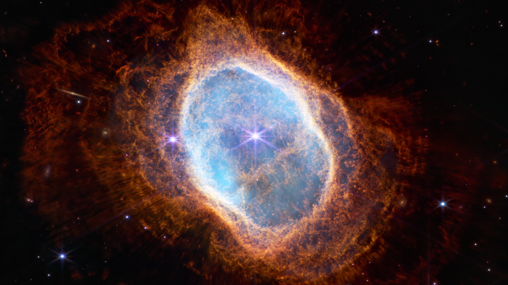
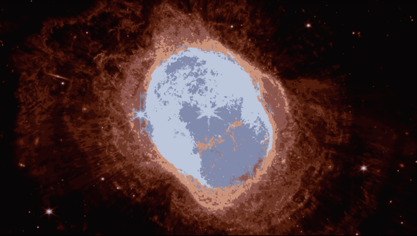

# Image Compressor

## Overview

This project focuses on utilizing K-Means Clustering and Gaussian Mixture Models for compressing images. The goal is to reduce the size of images while preserving essential visual information through the application of clustering algorithms.

## Table of Contents

- [Introduction](#introduction)
- [Installation](#installation)
- [Usage](#usage)
- [Methodology](#methodology)
- [Results](#results)

## Introduction

Images often contain redundant information, and image compression is a technique to reduce the size of image files without significant loss of quality. This project employs K-Means Clustering and Gaussian Mixture Models to cluster image pixels and represent them with fewer bits, resulting in compressed images. 

## Installation

1. Clone the repository:

```bash
git clone https://github.com/your-username/Image-Compressor.git
cd Image-Compressor
```

2. Open the Jupyter Notebook:

```bash
jupyter notebook
```

3. Navigate to the `main.ipynb` file and open it.

## Usage

Follow the instructions in the Jupyter Notebook to load your image, set compression parameters, and visualize the results. The notebook provides step-by-step explanations and code comments for better understanding.

## Methodology

The project utilizes the following methodologies:

- **K-Means Clustering:** Groups similar pixels together based on color similarity.
- **Gaussian Mixture Models (GMM):** Represents a pixel distribution as a mixture of Gaussian distributions, capturing complex relationships in the data.

The combination of these techniques allows for effective image compression.

## Results

The results section showcases original and compressed images, providing insights into the effectiveness of the compression algorithm. Feel free to experiment with different images and compression settings to observe the trade-off between file size and image quality. Here is a sample image compression:
 | 
:-------------------------:|:-------------------------:
Original Image | Compressed Image
